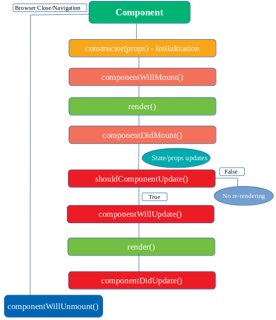

# State and Lifecycle

## Lifecycle

Every React Component has a lifecycle of its own, lifecycle of a component can be defined as the series of methods that are invoked in different stages of the component’s existence.  
A React Component can go through four stages of its life as follows.

- **Initialization**: This is the stage where the component is constructed with the given Props and default state. This is done in the constructor of a Component Class.
- **Mounting**: Mounting is the stage of rendering the JSX returned by the render method itself.
- **Updating**: Updating is the stage when the state of a component is updated and the application is repainted.
- **Unmounting**: As the name suggests Unmounting is the final step of the component lifecycle where the component is removed from the page.  
  [Explaination](https://www.freecodecamp.org/news/how-to-understand-a-components-lifecycle-methods-in-reactjs-e1a609840630/)  
    
  

## State

`State` is used with React Component Classes to make them dynamic. It enables the component to keep track of changing information in between renders. More specifically, the state of a component is an object that holds information that may change over the lifetime of the component.

`Props` are immutable and dont change during the lifetime of the component.

## Hooks Introduction

`Hooks` are a new addition in `React 16.8`. They let you use state and other React features without writing a class.

```javascript
import React, { useState } from "react";

const Example = () => {
  // Declare a new state variable, which we'll call "count"
  const [count, setCount] = useState(0);
  return (
    <div>
      {/*get count*/}
      <p>You clicked {count} times</p>

      {/*set count*/}
      <button onClick={() => setCount(count + 1)}>Click me</button>
    </div>
  );
};
```

We are going to look at only `useState` and `useEffect` hooks now.

- ### State Hook

  `useState` hook is used to add some local state to the functional component.  
   `useState` returns a pair: the _current state_ value and _a function_ that lets you update it. You can call this function from an event handler or somewhere else. It’s similar to `this.setState` in a class, except it doesn’t merge the old and new state together.

  **Note** that unlike this.state, the state here doesn’t have to be an object — although it can be if you want.

- ### Effect Hook

  [Explaination](https://blog.carbonfive.com/replacing-component-lifecycle-methods-with-react-hooks/) |
  [Docs](https://reactjs.org/docs/hooks-effect.html)

  Its not possible to use component lifecycle methods in the functional components.  
  Until React 16.8, the most common solution for handling lifecycle events required ES6 class-based components.
  The `useEffect` Hook lets you perform side effects in function components.  
  Data fetching, setting up a subscription, and manually changing the DOM in React components are all examples of side effects. You can think of useEffect Hook as `componentDidMount`, `componentDidUpdate`, and `componentWillUnmount` combined.

This project was bootstrapped with [Create React App](https://github.com/facebook/create-react-app).

## Available Scripts

In the project directory, you can run:

### `yarn start`

Runs the app in the development mode.<br />
Open [http://localhost:3000](http://localhost:3000) to view it in the browser.

The page will reload if you make edits.<br />
You will also see any lint errors in the console.

### `yarn test`

Launches the test runner in the interactive watch mode.<br />
See the section about [running tests](https://facebook.github.io/create-react-app/docs/running-tests) for more information.

### `yarn build`

Builds the app for production to the `build` folder.<br />
It correctly bundles React in production mode and optimizes the build for the best performance.

The build is minified and the filenames include the hashes.<br />
Your app is ready to be deployed!

See the section about [deployment](https://facebook.github.io/create-react-app/docs/deployment) for more information.

### `yarn eject`

**Note: this is a one-way operation. Once you `eject`, you can’t go back!**

If you aren’t satisfied with the build tool and configuration choices, you can `eject` at any time. This command will remove the single build dependency from your project.

Instead, it will copy all the configuration files and the transitive dependencies (webpack, Babel, ESLint, etc) right into your project so you have full control over them. All of the commands except `eject` will still work, but they will point to the copied scripts so you can tweak them. At this point you’re on your own.

You don’t have to ever use `eject`. The curated feature set is suitable for small and middle deployments, and you shouldn’t feel obligated to use this feature. However we understand that this tool wouldn’t be useful if you couldn’t customize it when you are ready for it.

## Learn More

You can learn more in the [Create React App documentation](https://facebook.github.io/create-react-app/docs/getting-started).

To learn React, check out the [React documentation](https://reactjs.org/).
